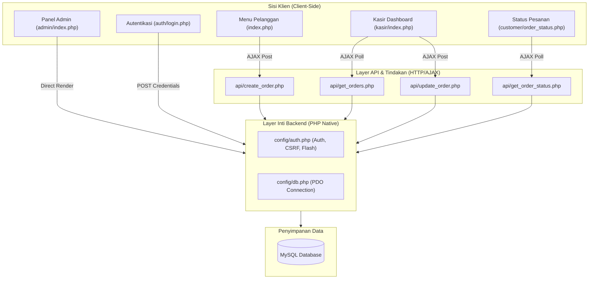
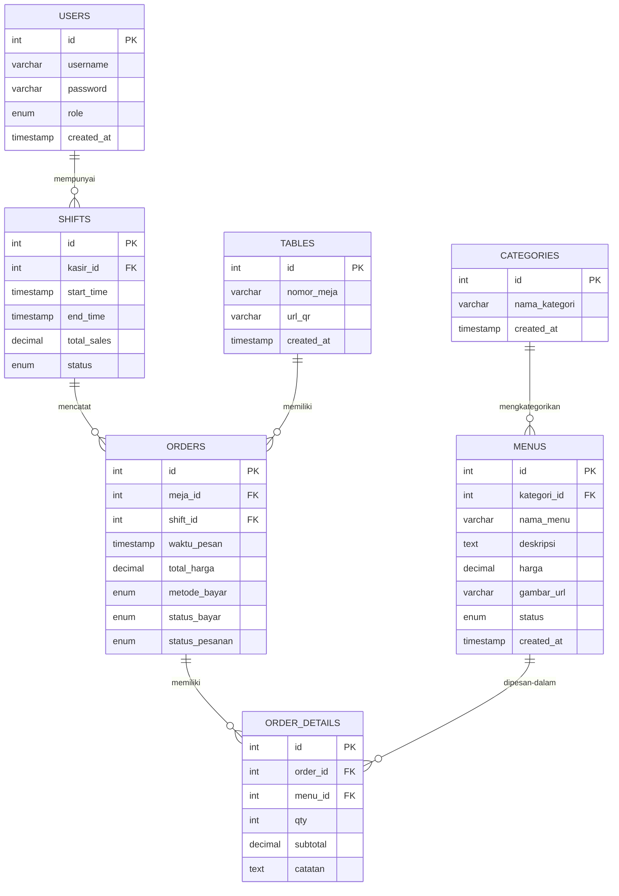

# Arsitektur & Desain Proyek: Sistem Pemesanan Kafe

Dokumen ini menjelaskan arsitektur perangkat lunak, skema basis data, aliran data, serta gaya desain visual yang diterapkan dalam **Sistem Pemesanan Kafe Berbasis QR Code**.

---

## 1. Arsitektur Perangkat Lunak (Software Architecture)

Aplikasi ini menggunakan pola arsitektur **Clean Native PHP-JS** yang memisahkan tanggung jawab (Separation of Concerns) secara modular tanpa menggunakan framework berat. Struktur ini dirancang untuk kecepatan eksekusi tinggi dan portabilitas maksimal.

### Penjelasan Komponen Utama:
1.  **Presentational Layer (Frontend):** 
    *   Halaman statis dirender oleh PHP secara dinamis di server, lalu ditingkatkan interaktivitasnya di sisi klien menggunakan Javascript murni ([app.js](file:///c:/laragon/www/PEMESANAN-AK/assets/js/app.js) & [kasir.js](file:///c:/laragon/www/PEMESANAN-AK/assets/js/kasir.js)).
2.  **API Layer (Asynchronous Endpoints):**
    *   Berfungsi sebagai jembatan data antara antarmuka kasir/pelanggan yang interaktif dengan basis data tanpa memerlukan pemuatan ulang halaman (*page refresh*).
3.  **Core Shared Layer (Helper & DB):**
    *   [db.php](file:///c:/laragon/www/PEMESANAN-AK/config/db.php): Menyediakan koneksi tunggal PDO dengan mode penanganan kesalahan exception (`ERRMODE_EXCEPTION`) dan pengambilan array asosiatif secara default.
    *   [auth.php](file:///c:/laragon/www/PEMESANAN-AK/config/auth.php): Menangani otentikasi berbasis session, otorisasi role (`admin` / `kasir`), pertahanan keamanan CSRF (`csrf_token`, `verifyCsrf`), serta mekanisme flash message.

---

## 2. Skema & Hubungan Basis Data (Database Schema)

Sistem ini didukung oleh database relasional MySQL. Berikut adalah Diagram Hubungan Entitas (ERD):

### Kamus Data Singkat (Data Dictionary):
*   **`users`**: Menyimpan kredensial staf. Password dienkripsi menggunakan fungsi aman PHP `password_hash()` berbasis bcrypt.
*   **`tables`**: Identitas fisik meja pelanggan. Setiap meja dikaitkan dengan kode QR unik.
*   **`categories`**: Klasifikasi menu (seperti Coffee, Non-Coffee, Snacks).
*   **`menus`**: Menyimpan detail item produk kafe dengan validasi status ketersediaan (`tersedia` / `habis`).
*   **`shifts`**: Menjaga integritas pelaporan penjualan per sesi kerja kasir aktif. Saat shift ditutup, total transaksi yang berstatus `paid` dan `selesai` pada shift tersebut akan direkap.
*   **`orders`**: Header transaksi utama yang menyimpan metode bayar (`cash` / `qris`), status bayar, dan alur status pesanan.
*   **`order_details`**: Rincian item pesanan, kuantitas, subtotal, dan instruksi khusus (catatan) pelanggan.

---

## 3. Gaya Desain & Visual Antarmuka (UI/UX Design Style)

Tipe desain visual yang digunakan dalam sistem ini mengusung tema **Swiss Minimalist & High Contrast Dark-Light (Neo-Brutalism Light)**.

Desain ini berfokus pada kejelasan informasi ekstrem (readability), tata letak geometris yang bersih, dan meminimalkan dekorasi visual yang tidak fungsional.

### Karakteristik Visual Utama:
1.  **Tipografi yang Kuat & Kontras (Typography-First):**
    *   Menggunakan pemisahan ukuran teks yang kontras (seperti judul besar tebal disandingkan dengan deskripsi abu-abu berukuran kecil).
    *   Kerning ketat (`tracking-tight`) untuk judul besar dan kerning lebar (`tracking-widest`) untuk tag/kicker label berkapital murni.
    *   Menggunakan kelas `tabular-nums` untuk menampilkan harga dan angka agar lebar karakter seragam (mencegah teks bergeser saat data berubah).
2.  **Palet Warna "Void & Aksen Kontras" (Color Palette):**
    *   **Void (Latar Belakang):** Putih bersih (`#FAFAFA` atau `#FFFFFF`) dengan kontras hitam pekat (`#000000` atau `#171717`) untuk elemen interaktif utama.
    *   **Surface:** Menggunakan batas tipis abu-abu terang (`border-neutral-200`) untuk memisahkan kartu informasi tanpa membuat layout terasa berat.
    *   **Micro-interactions Glow:** Menggunakan efek transisi snappier (`transition-snappy` dengan durasi cepat) dan efek tekan visual dinamis (`active:scale-[0.98]`).
3.  **Desain Spasial & Bentuk Komponen:**
    *   **Bottom Sheet (Mobile Mutasi):** Keranjang belanja dirancang sebagai *bottom sheet* melayang pada perangkat seluler, memberikan kesan aplikasi native iOS/Android dengan latar belakang overlay yang buram (`backdrop-blur-md`).
    *   **Formulir Minimalis:** Bidang input login/catatan dirancang bergaya minimalis terintegrasi (hanya border bawah yang disorot saat fokus).
    *   **Filter Kapsul (Pills Filter):** Tombol filter kategori menggunakan bentuk kapsul bulat penuh (`rounded-full`) yang mudah ditekan pada layar sentuh.

---

## 4. Pola Keamanan & Integritas Data

1.  **Anti-Price-Tampering (Validasi Harga Sisi Server):**
    *   Ketika pelanggan mengirimkan keranjang pesanan, harga produk yang tersimpan di sisi klien (Javascript) **diabaikan**. Backend ([create_order.php](file:///c:/laragon/www/PEMESANAN-AK/api/create_order.php)) akan mencocokkan ID menu ke basis data untuk mengambil harga resmi dan menghitung subtotal akhir di server sebelum melakukan penyimpanan.
2.  **Mitigasi CSRF (Cross-Site Request Forgery):**
    *   Setiap formulir POST admin/staf dilindungi oleh token acak satu sesi menggunakan `csrf_field()` dan divalidasi dengan `verifyCsrf()` di backend sebelum aksi dijalankan.
3.  **Pencegahan SQL Injection:**
    *   Koneksi database PDO memaksimalkan penggunaan *Prepared Statements* (`$pdo->prepare()`) dengan *parameter binding* terpisah, mensterilkan seluruh input dinamis dari celah eksploitasi SQL.
