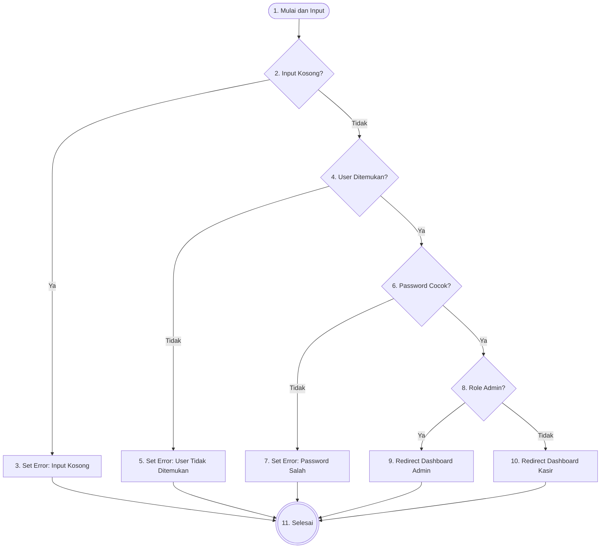
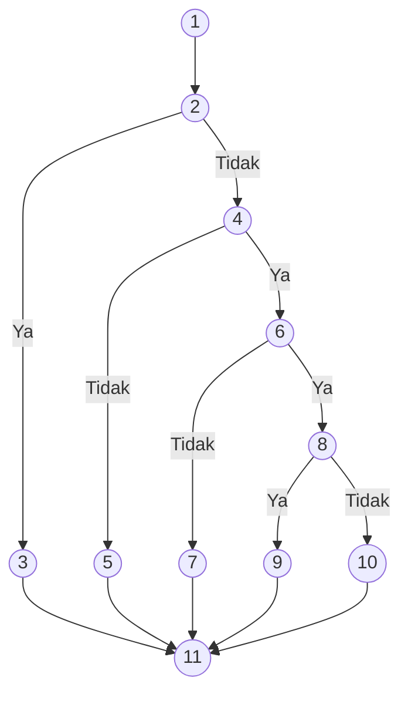
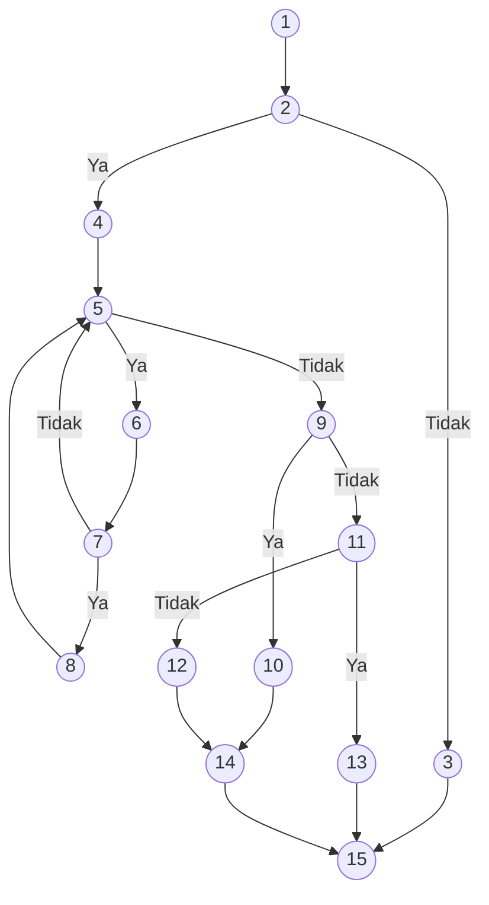
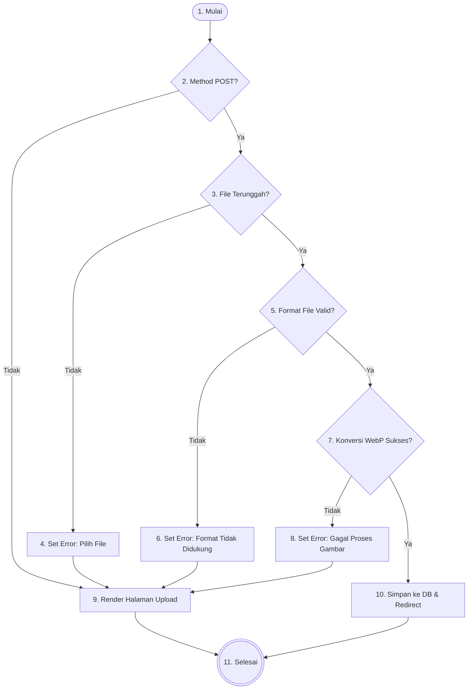
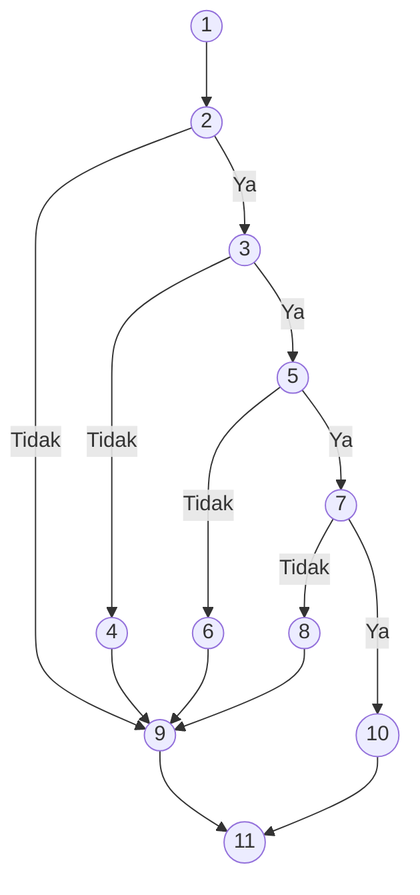

# Dokumen Pengujian White Box (Sistem Pemesanan Cafe AK)

Dokumen ini berisi pengujian *White Box* untuk tiga fitur utama pada sistem pemesanan Cafe AK:
1. **Proses Login Multi-Role (`auth/login.php`)**
2. **Proses Checkout Pelanggan (`api/create_order.php`)**
3. **Proses Konfirmasi Pembayaran QRIS (`customer/qris_payment.php`)**

---

## 🔑 1. Pengujian White Box: Login (`auth/login.php`)

Pengujian *White Box* untuk proses login berfokus pada validasi input, pencarian user, verifikasi password, dan pengalihan (redirect) berdasarkan role.

### A. Flowchart & Flowgraph

#### 📊 Flowchart Proses Login

#### 📈 Flowgraph

### B. Tabel Keterangan Node
| Node | Logika / Aktivitas | Deskripsi |
| :---: | :--- | :--- |
| **1** | `Mulai & Input` | Sistem menerima input *username* dan *password* dari pengguna. |
| **2** | `if (empty($user) \|\| empty($pass))` | Node Keputusan: Pengecekan apakah input kosong. |
| **3** | `Set Error` | Jika kosong (Ya), sistem mengatur pesan error validasi. |
| **4** | `if ($user_ditemukan)` | Node Keputusan: Pengecekan apakah username ada di database. |
| **5** | `Set Error` | Jika tidak ditemukan (Tidak), sistem mengatur pesan error user tidak terdaftar. |
| **6** | `if (password_verify(...))` | Node Keputusan: Pengecekan kecocokan password. |
| **7** | `Set Error` | Jika salah (Tidak), sistem mengatur pesan error password salah. |
| **8** | `if ($role == 'admin')` | Node Keputusan: Pengecekan role pengguna yang berhasil login. |
| **9** | `Redirect` | Jika Admin (Ya), sistem mengarahkan ke dashboard Admin. |
| **10** | `Redirect` | Jika Kasir (Tidak), sistem mengarahkan ke dashboard Kasir. |
| **11** | `Selesai` | Akhir proses (menampilkan halaman dengan pesan error atau berhasil masuk). |

### C. Perhitungan Cyclomatic Complexity (CC) & Jumlah Region
Berdasarkan visualisasi flowgraph di atas, kita dapat menghitung kompleksitas siklomatisnya:

* **Jumlah Sisi (Edges, E)** = 14
* **Jumlah Node (N)** = 11
* **Rumus**: $V(G) = E - N + 2$
* **Perhitungan**: $V(G) = 14 - 11 + 2 = 5$

Metode *Predicate Node* (Node Keputusan):
* Terdapat 4 Predicate Node (Node 2, 4, 6, dan 8).
* **Rumus**: $V(G) = P + 1$
* **Perhitungan**: $V(G) = 4 + 1 = 5$

**Jumlah Region (Daerah)**:
* **Jumlah Region = 5** (Terdapat 4 area tertutup di dalam graf dan 1 area terbuka di luar graf).

*Maka, terdapat **5 Jalur Independen** dalam proses login.*

### D. Jalur Independen (Independent Paths)
Berdasarkan perhitungan CC sebanyak 5, berikut adalah 5 jalur independen yang menguji setiap kemungkinan logika:

1. **Path 1 (Input Kosong)**:
   `1 -> 2 -> 3 -> 11`
2. **Path 2 (User Tidak Ditemukan)**:
   `1 -> 2 -> 4 -> 5 -> 11`
3. **Path 3 (Password Salah)**:
   `1 -> 2 -> 4 -> 6 -> 7 -> 11`
4. **Path 4 (Login Sukses - Role Admin)**:
   `1 -> 2 -> 4 -> 6 -> 8 -> 9 -> 11`
5. **Path 5 (Login Sukses - Role Kasir)**:
   `1 -> 2 -> 4 -> 6 -> 8 -> 10 -> 11`

---

## 🛒 2. Pengujian White Box: Checkout Pelanggan (`api/create_order.php`)

Pengujian *White Box* untuk proses checkout berfokus pada validasi input JSON, pemrosesan item pesanan, pengecekan shift kasir aktif, dan eksekusi transaksi database.

### A. Flowchart & Flowgraph

#### 📊 Flowchart Proses Checkout

#### 📈 Flowgraph

### B. Tabel Keterangan Node
| Node | Logika / Aktivitas | Deskripsi |
| :---: | :--- | :--- |
| **1** | `Mulai & Terima JSON` | Sistem menerima data input JSON dari sisi klien berupa `meja_id`, `metode_bayar`, `uang_dibayar`, dan `items`. |
| **2** | `if (!$data \|\| empty(meja_id) \|\| ...)` | Node Keputusan: Pengecekan kelengkapan data request. |
| **3** | `Output Error` | Jika tidak lengkap (Tidak), kirim response JSON error dan hentikan script. |
| **4** | `beginTransaction()` | Jika data lengkap (Ya), mulai transaksi database PDO dan inisialisasi variabel. |
| **5** | `foreach ($items as $item)` | Node Keputusan (Loop): Pengecekan apakah masih ada item pesanan yang perlu diproses. |
| **6** | `Query menus` | Eksekusi query untuk mengambil data harga dan status menu dari tabel `menus`. |
| **7** | `if ($menu && status == 'tersedia')` | Node Keputusan: Apakah menu ditemukan dan berstatus tersedia. |
| **8** | `Hitung Subtotal` | Menghitung subtotal per item dan memasukkannya ke array `$validItems`. |
| **9** | `if (empty($validItems))` | Node Keputusan: Apakah tidak ada item valid yang bisa diproses. |
| **10** | `throw Exception` | Jika kosong (Ya), lempar exception: stok habis atau menu tidak valid. |
| **11** | `if ($activeShift)` | Node Keputusan: Pengecekan apakah terdapat shift kasir yang sedang aktif. |
| **12** | `throw Exception` | Jika tidak ada shift (Tidak), lempar exception: kasir offline. |
| **13** | `INSERT + commit()` | Jika shift ada (Ya), insert data ke `orders` & `order_details`, lalu commit transaksi. |
| **14** | `rollBack() + Output Error` | Blok catch: rollback transaksi dan kirim response JSON error. |
| **15** | `Selesai` | Akhir proses: kirim response JSON sukses atau selesai setelah error handling. |

### C. Perhitungan Cyclomatic Complexity (CC) & Jumlah Region
* **Jumlah Sisi (Edges, E)** = 19
* **Jumlah Node (N)** = 15
* **Rumus**: $V(G) = E - N + 2$
* **Perhitungan**: $V(G) = 19 - 15 + 2 = 6$

Metode *Predicate Node* (Node Keputusan):
* Terdapat 5 Predicate Node: Node 2, 5, 7, 9, dan 11.
* **Rumus**: $V(G) = P + 1$
* **Perhitungan**: $V(G) = 5 + 1 = 6$

**Jumlah Region (Daerah)**:
* **Jumlah Region = 6** (Terdapat 5 area tertutup di dalam graf dan 1 area terbuka di luar graf).

*Maka, terdapat **6 Jalur Independen**.*

### D. Jalur Independen (Independent Paths)
1. **Path 1 (Data Tidak Lengkap)**:
   `1 -> 2 -> 3 -> 15`
2. **Path 2 (Semua Item Habis/Tidak Valid)**:
   `1 -> 2 -> 4 -> 5 -> 6 -> 7 -> 5 -> 9 -> 10 -> 14 -> 15`
3. **Path 3 (Item Valid, Kasir Offline)**:
   `1 -> 2 -> 4 -> 5 -> 6 -> 7 -> 8 -> 5 -> 9 -> 11 -> 12 -> 14 -> 15`
4. **Path 4 (Item Valid, Kasir Aktif, Insert Sukses)**:
   `1 -> 2 -> 4 -> 5 -> 6 -> 7 -> 8 -> 5 -> 9 -> 11 -> 13 -> 15`
5. **Path 5 (Item Valid, Insert Gagal/Exception)**:
   `1 -> 2 -> 4 -> 5 -> 6 -> 7 -> 8 -> 5 -> 9 -> 11 -> 13 -> 14 -> 15`
6. **Path 6 (Ada Item Tidak Valid, Lalu Item Valid Sukses)**:
   `1 -> 2 -> 4 -> 5 -> 6 -> 7 -> 5 -> 6 -> 7 -> 8 -> 5 -> 9 -> 11 -> 13 -> 15`

---

## 📸 3. Pengujian White Box: Konfirmasi Pembayaran QRIS (`customer/qris_payment.php`)

Pengujian *White Box* untuk proses upload bukti transfer QRIS berfokus pada validasi file yang diunggah, pemeriksaan format/MIME, konversi gambar, dan penyimpanan ke database.

### A. Flowchart & Flowgraph

#### 📊 Flowchart Proses Upload Bukti QRIS

#### 📈 Flowgraph

### B. Tabel Keterangan Node
| Node | Logika / Aktivitas | Deskripsi |
| :---: | :--- | :--- |
| **1** | `Mulai` | Sistem memuat halaman konfirmasi pembayaran QRIS. |
| **2** | `if (METHOD == 'POST')` | Node Keputusan: Apakah pengguna mengirimkan form upload (POST). |
| **3** | `if (isset($_FILES) && UPLOAD_ERR_OK)` | Node Keputusan: Apakah file berhasil terunggah tanpa error. |
| **4** | `Set Error` | Jika file tidak ada (Tidak), set pesan error: pilih gambar terlebih dahulu. |
| **5** | `if (ext & MIME valid)` | Node Keputusan: Apakah ekstensi dan MIME type file valid (JPG/PNG/WEBP). |
| **6** | `Set Error` | Jika format tidak valid (Tidak), set pesan error: format tidak didukung. |
| **7** | `convertToWebp(...)` | Node Keputusan: Apakah konversi gambar ke format WebP berhasil. |
| **8** | `Set Error` | Jika konversi gagal (Tidak), set pesan error: gagal memproses gambar. |
| **9** | `Render HTML` | Menampilkan antarmuka halaman upload beserta pesan error jika ada. |
| **10** | `UPDATE DB + Redirect` | Jika sukses (Ya), simpan path ke database dan redirect ke halaman status pesanan. |
| **11** | `Selesai` | Akhir proses: pengguna diarahkan ke halaman status atau tetap di halaman upload. |

### C. Perhitungan Cyclomatic Complexity (CC) & Jumlah Region
* **Jumlah Sisi (Edges, E)** = 14
* **Jumlah Node (N)** = 11
* **Rumus**: $V(G) = E - N + 2$
* **Perhitungan**: $V(G) = 14 - 11 + 2 = 5$

Metode *Predicate Node* (Node Keputusan):
* Terdapat 4 Predicate Node: Node 2, 3, 5, dan 7.
* **Rumus**: $V(G) = P + 1$
* **Perhitungan**: $V(G) = 4 + 1 = 5$

**Jumlah Region (Daerah)**:
* **Jumlah Region = 5** (Terdapat 4 area tertutup di dalam graf dan 1 area terbuka di luar graf).

*Maka, terdapat **5 Jalur Independen**.*

### D. Jalur Independen (Independent Paths)
1. **Path 1 (Halaman Awal / GET Request)**:
   `1 -> 2 -> 9 -> 11`
2. **Path 2 (POST, File Tidak Diunggah)**:
   `1 -> 2 -> 3 -> 4 -> 9 -> 11`
3. **Path 3 (POST, Format File Tidak Valid)**:
   `1 -> 2 -> 3 -> 5 -> 6 -> 9 -> 11`
4. **Path 4 (POST, File Valid, Konversi Gagal)**:
   `1 -> 2 -> 3 -> 5 -> 7 -> 8 -> 9 -> 11`
5. **Path 5 (POST, File Valid, Upload Sukses)**:
   `1 -> 2 -> 3 -> 5 -> 7 -> 10 -> 11`
