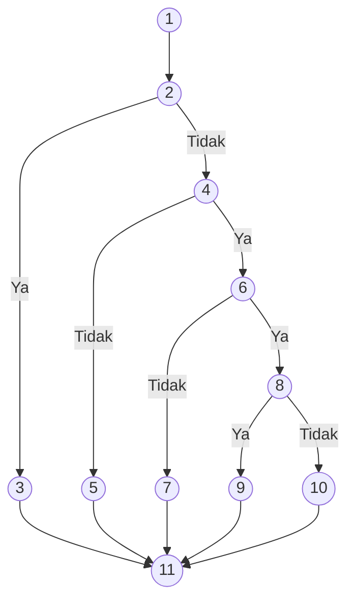
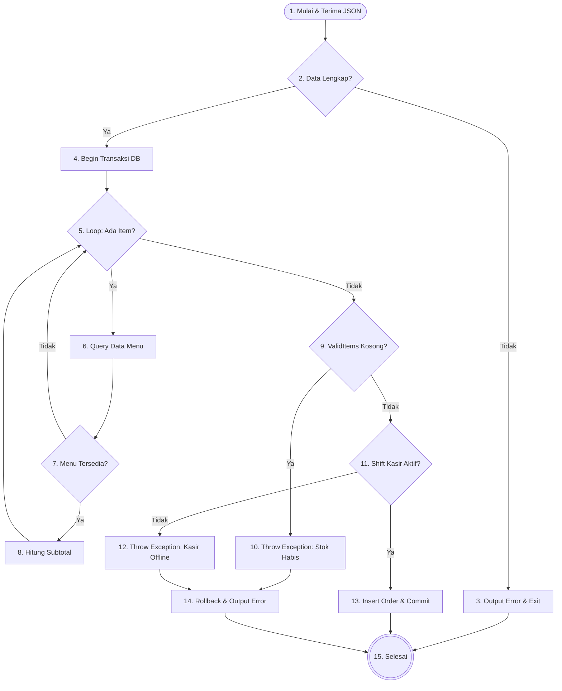
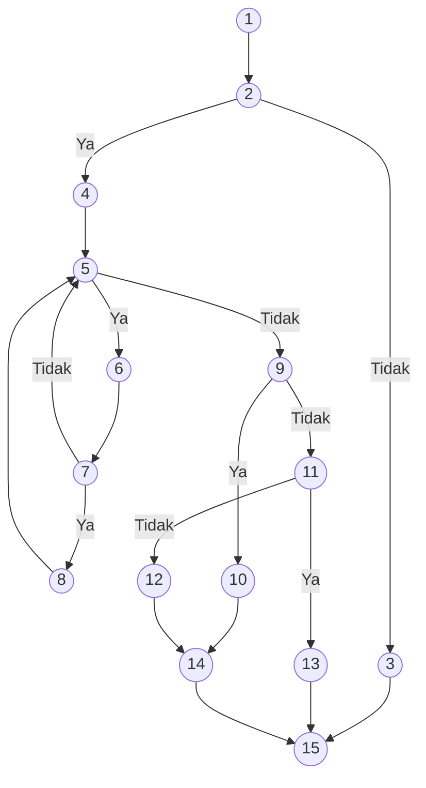
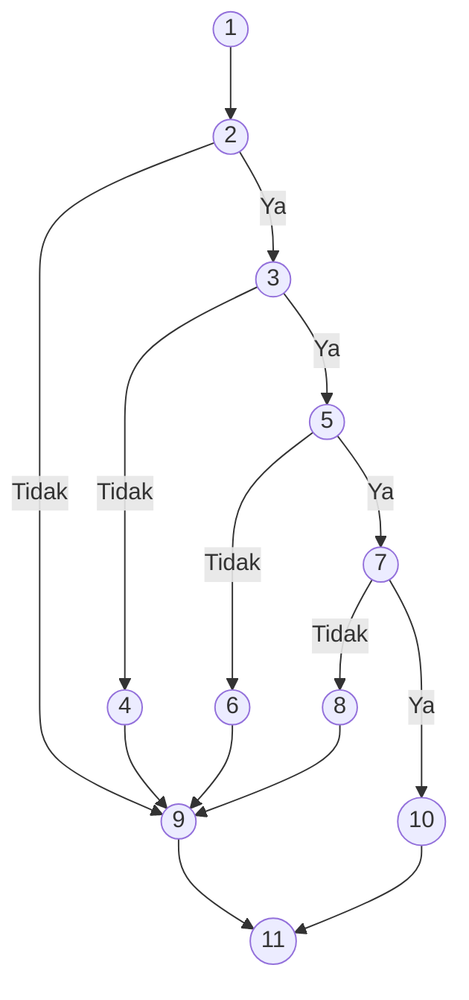

# Dokumen Pengujian White Box (Sistem Pemesanan Cafe AK)

Dokumen ini berisi pengujian *White Box* untuk tiga fitur utama pada sistem pemesanan Cafe AK:
1. **Proses Login Multi-Role (`auth/login.php`)**
2. **Proses Checkout Pelanggan (`api/create_order.php`)**
3. **Proses Konfirmasi Pembayaran QRIS (`customer/qris_payment.php`)**

---

## 🔑 1. Pengujian White Box: Login (`auth/login.php`)

### A. Flowchart & Flowgraph

#### 📊 Flowchart Proses Login

#### 📈 Flowgraph

### B. Tabel Keterangan Node

| Node | Logika / Kode | Deskripsi |
| :--- | :--- | :--- |
| **Node 1** | `session_status() === PHP_SESSION_NONE` `{ session_start(); }` (auth/login.php : 2–3) | Memulai sesi PHP untuk menyimpan status login pengguna. |
| **Node 2** | `if (empty($username) \|\| empty($password))` (auth/login.php : 25) | Guard: Pengecekan apakah input *username* atau *password* kosong. |
| **Node 3** | `$error = 'Username dan password wajib diisi.';` (auth/login.php : 26) | Menetapkan pesan error validasi input kosong lalu kembali ke halaman form. |
| **Node 4** | `$stmt->execute(['username' => $username]); $user = $stmt->fetch();` (auth/login.php : 30–31) | Eksekusi query ke database untuk mencari data user berdasarkan username. |
| **Node 5** | `$error = 'Username atau password salah.';` (auth/login.php : 50) | Menetapkan pesan error karena user tidak ditemukan di database. |
| **Node 6** | `if ($user && password_verify($password, $user['password']))` (auth/login.php : 33) | Pengecekan kecocokan password menggunakan fungsi `password_verify()`. |
| **Node 7** | `$error = 'Username atau password salah.';` (auth/login.php : 50) | Menetapkan pesan error karena password tidak cocok dengan hash di database. |
| **Node 8** | `if ($user['role'] === 'admin')` (auth/login.php : 43) | Pengecekan role pengguna yang berhasil login untuk menentukan arah redirect. |
| **Node 9** | `header("Location: ../admin/index.php"); exit;` (auth/login.php : 44, 48) | Redirect pengguna ke halaman dashboard Admin. |
| **Node 10** | `header("Location: ../kasir/index.php"); exit;` (auth/login.php : 46, 48) | Redirect pengguna ke halaman dashboard Kasir. |
| **Node 11** | Akhir eksekusi script PHP (auth/login.php : 58–126) | Selesai: script PHP selesai, halaman HTML login dirender dengan pesan error jika ada. |

### C. Perhitungan Cyclomatic Complexity (CC) & Jumlah Region

* **Jumlah Sisi (Edges, E)** = 14
* **Jumlah Node (N)** = 11
* **Rumus**: $V(G) = E - N + 2$
* **Perhitungan**: $V(G) = 14 - 11 + 2 = 5$

Metode *Predicate Node* (Node Keputusan):
* Terdapat 4 Predicate Node (Node 2, 4, 6, dan 8).
* **Rumus**: $V(G) = P + 1$
* **Perhitungan**: $V(G) = 4 + 1 = 5$

**Jumlah Region (Daerah)**:
* **Jumlah Region = 5** (Terdapat 4 area tertutup di dalam graf dan 1 area terbuka di luar graf).

*Maka, terdapat **5 Jalur Independen** dalam proses login.*

### D. Jalur Independen (Independent Paths)

1. **Path 1 (Input Kosong)**:
   `1 -> 2 -> 3 -> 11`
2. **Path 2 (User Tidak Ditemukan)**:
   `1 -> 2 -> 4 -> 5 -> 11`
3. **Path 3 (Password Salah)**:
   `1 -> 2 -> 4 -> 6 -> 7 -> 11`
4. **Path 4 (Login Sukses - Role Admin)**:
   `1 -> 2 -> 4 -> 6 -> 8 -> 9 -> 11`
5. **Path 5 (Login Sukses - Role Kasir)**:
   `1 -> 2 -> 4 -> 6 -> 8 -> 10 -> 11`

---

## 🛒 2. Pengujian White Box: Checkout Pelanggan (`api/create_order.php`)

### A. Flowchart & Flowgraph

#### 📊 Flowchart Proses Checkout

#### 📈 Flowgraph

### B. Tabel Keterangan Node

| Node | Logika / Kode | Deskripsi |
| :--- | :--- | :--- |
| **Node 1** | `$data = json_decode(file_get_contents('php://input'), true);` (api/create_order.php : 7) | Menerima dan mendekode data input JSON dari sisi klien. |
| **Node 2** | `if (!$data \|\| empty($data['meja_id']) \|\| empty($data['items']) \|\| empty($data['metode_bayar']))` (api/create_order.php : 9) | Pengecekan kelengkapan seluruh parameter data request yang dikirimkan. |
| **Node 3** | `echo json_encode(['success' => false, 'message' => 'Data pesanan tidak lengkap']); exit;` (api/create_order.php : 10–11) | Mengirim response JSON error jika data tidak lengkap, lalu menghentikan script. |
| **Node 4** | `$pdo->beginTransaction(); $totalHarga = 0; $validItems = [];` (api/create_order.php : 19–23) | Memulai transaksi database PDO dan menginisialisasi variabel penghitung. |
| **Node 5** | `foreach ($items as $item)` (api/create_order.php : 26) | Perulangan pemrosesan setiap item pesanan yang dikirim oleh klien. |
| **Node 6** | `$stmtMenu = $pdo->prepare("SELECT id, nama_menu, harga, status FROM menus WHERE id = ?"); $stmtMenu->execute([$menuId]);` (api/create_order.php : 33–35) | Eksekusi query untuk mengambil data harga dan status ketersediaan menu. |
| **Node 7** | `if ($menu && $menu['status'] === 'tersedia')` (api/create_order.php : 37) | Pengecekan apakah menu ditemukan di database dan berstatus tersedia. |
| **Node 8** | `$subtotal = $menu['harga'] * $qty; $totalHarga += $subtotal; $validItems[] = [...]` (api/create_order.php : 38–46) | Menghitung subtotal item dan menambahkannya ke array `$validItems`. |
| **Node 9** | `if (empty($validItems))` (api/create_order.php : 58) | Pengecekan apakah tidak ada satu pun item yang valid untuk diproses. |
| **Node 10** | `throw new Exception("Semua item pesanan tidak valid atau stok habis.");` (api/create_order.php : 59) | Melempar exception jika semua item tidak valid atau stok habis. |
| **Node 11** | `$activeShift = $stmtShift->fetch(); if (!$activeShift)` (api/create_order.php : 63–66) | Mencari dan mengecek keberadaan shift kasir yang sedang aktif. |
| **Node 12** | `throw new Exception("Mohon maaf, kasir sedang offline...");` (api/create_order.php : 67) | Melempar exception jika tidak ada shift kasir aktif saat ini. |
| **Node 13** | `$stmtOrder->execute([...]); $stmtDetail->execute([...]); $pdo->commit();` (api/create_order.php : 73–94) | Insert data pesanan ke tabel `orders` & `order_details`, lalu commit transaksi. |
| **Node 14** | `$pdo->rollBack(); echo json_encode(['success' => false, 'message' => ...]);` (api/create_order.php : 102–104) | Blok catch: rollback transaksi dan kirim response JSON error. |
| **Node 15** | `echo json_encode(['success' => true, 'order_id' => $orderId, ...]);` (api/create_order.php : 96–100) | Mengirim response JSON sukses beserta ID pesanan yang baru dibuat. |

### C. Perhitungan Cyclomatic Complexity (CC) & Jumlah Region

* **Jumlah Sisi (Edges, E)** = 19
* **Jumlah Node (N)** = 15
* **Rumus**: $V(G) = E - N + 2$
* **Perhitungan**: $V(G) = 19 - 15 + 2 = 6$

Metode *Predicate Node* (Node Keputusan):
* Terdapat 5 Predicate Node: Node 2, 5, 7, 9, dan 11.
* **Rumus**: $V(G) = P + 1$
* **Perhitungan**: $V(G) = 5 + 1 = 6$

**Jumlah Region (Daerah)**:
* **Jumlah Region = 6** (Terdapat 5 area tertutup di dalam graf dan 1 area terbuka di luar graf).

*Maka, terdapat **6 Jalur Independen**.*

### D. Jalur Independen (Independent Paths)

1. **Path 1 (Data Tidak Lengkap)**:
   `1 -> 2 -> 3 -> 15`
2. **Path 2 (Semua Item Habis/Tidak Valid)**:
   `1 -> 2 -> 4 -> 5 -> 6 -> 7 -> 5 -> 9 -> 10 -> 14 -> 15`
3. **Path 3 (Item Valid, Kasir Offline)**:
   `1 -> 2 -> 4 -> 5 -> 6 -> 7 -> 8 -> 5 -> 9 -> 11 -> 12 -> 14 -> 15`
4. **Path 4 (Item Valid, Kasir Aktif, Insert Sukses)**:
   `1 -> 2 -> 4 -> 5 -> 6 -> 7 -> 8 -> 5 -> 9 -> 11 -> 13 -> 15`
5. **Path 5 (Item Valid, Insert Gagal/Exception)**:
   `1 -> 2 -> 4 -> 5 -> 6 -> 7 -> 8 -> 5 -> 9 -> 11 -> 13 -> 14 -> 15`
6. **Path 6 (Ada Item Tidak Valid, Lalu Item Valid Sukses)**:
   `1 -> 2 -> 4 -> 5 -> 6 -> 7 -> 5 -> 6 -> 7 -> 8 -> 5 -> 9 -> 11 -> 13 -> 15`

---

## 📸 3. Pengujian White Box: Konfirmasi Pembayaran QRIS (`customer/qris_payment.php`)

### A. Flowchart & Flowgraph

#### 📊 Flowchart Proses Upload Bukti QRIS

#### 📈 Flowgraph

### B. Tabel Keterangan Node

| Node | Logika / Kode | Deskripsi |
| :--- | :--- | :--- |
| **Node 1** | `require_once '../config/db.php'; $orderId = isset($_GET['id']) ? (int)$_GET['id'] : 0;` (customer/qris_payment.php : 2–4) | Memuat konfigurasi database dan mengambil ID pesanan dari parameter URL. |
| **Node 2** | `if ($_SERVER['REQUEST_METHOD'] === 'POST')` (customer/qris_payment.php : 28) | Pengecekan apakah pengguna mengirimkan form upload (method POST). |
| **Node 3** | `if (isset($_FILES['bukti_transfer']) && $_FILES['bukti_transfer']['error'] === UPLOAD_ERR_OK)` (customer/qris_payment.php : 29) | Pengecekan apakah file berhasil diunggah ke server tanpa error. |
| **Node 4** | `$error = 'Silakan pilih gambar bukti transfer terlebih dahulu.';` (customer/qris_payment.php : 67) | Menetapkan pesan error jika tidak ada file yang dipilih saat submit. |
| **Node 5** | `if (in_array($fileExt, $allowedExts) && in_array($mime, $allowedMimes))` (customer/qris_payment.php : 41) | Pengecekan apakah ekstensi file dan MIME type termasuk dalam format yang diizinkan. |
| **Node 6** | `$error = 'Format file tidak didukung. Harap gunakan gambar JPG, PNG, atau WEBP.';` (customer/qris_payment.php : 64) | Menetapkan pesan error jika format file tidak valid. |
| **Node 7** | `if (convertToWebp($fileTmp, $destPath))` (customer/qris_payment.php : 51) | Pengecekan apakah konversi gambar ke format WebP berhasil dilakukan. |
| **Node 8** | `$error = 'Gagal memproses gambar bukti transfer.';` (customer/qris_payment.php : 61) | Menetapkan pesan error jika proses konversi gambar ke WebP gagal. |
| **Node 9** | Render HTML form upload (customer/qris_payment.php : 71–179) | Menampilkan antarmuka halaman upload QRIS, kode QR, dan pesan error jika ada. |
| **Node 10** | `$stmtUpd->execute([$dbPath, $orderId]); header("Location: order_status.php?id=" . $orderId); exit;` (customer/qris_payment.php : 55–59) | Menyimpan path bukti transfer ke database, lalu redirect ke halaman status pesanan. |
| **Node 11** | Akhir eksekusi proses upload (customer/qris_payment.php : 180) | Selesai: pengguna diarahkan ke halaman status pesanan atau tetap di halaman upload. |

### C. Perhitungan Cyclomatic Complexity (CC) & Jumlah Region

* **Jumlah Sisi (Edges, E)** = 14
* **Jumlah Node (N)** = 11
* **Rumus**: $V(G) = E - N + 2$
* **Perhitungan**: $V(G) = 14 - 11 + 2 = 5$

Metode *Predicate Node* (Node Keputusan):
* Terdapat 4 Predicate Node: Node 2, 3, 5, dan 7.
* **Rumus**: $V(G) = P + 1$
* **Perhitungan**: $V(G) = 4 + 1 = 5$

**Jumlah Region (Daerah)**:
* **Jumlah Region = 5** (Terdapat 4 area tertutup di dalam graf dan 1 area terbuka di luar graf).

*Maka, terdapat **5 Jalur Independen**.*

### D. Jalur Independen (Independent Paths)

1. **Path 1 (Halaman Awal / GET Request)**:
   `1 -> 2 -> 9 -> 11`
2. **Path 2 (POST, File Tidak Diunggah)**:
   `1 -> 2 -> 3 -> 4 -> 9 -> 11`
3. **Path 3 (POST, Format File Tidak Valid)**:
   `1 -> 2 -> 3 -> 5 -> 6 -> 9 -> 11`
4. **Path 4 (POST, File Valid, Konversi Gagal)**:
   `1 -> 2 -> 3 -> 5 -> 7 -> 8 -> 9 -> 11`
5. **Path 5 (POST, File Valid, Upload Sukses)**:
   `1 -> 2 -> 3 -> 5 -> 7 -> 10 -> 11`
