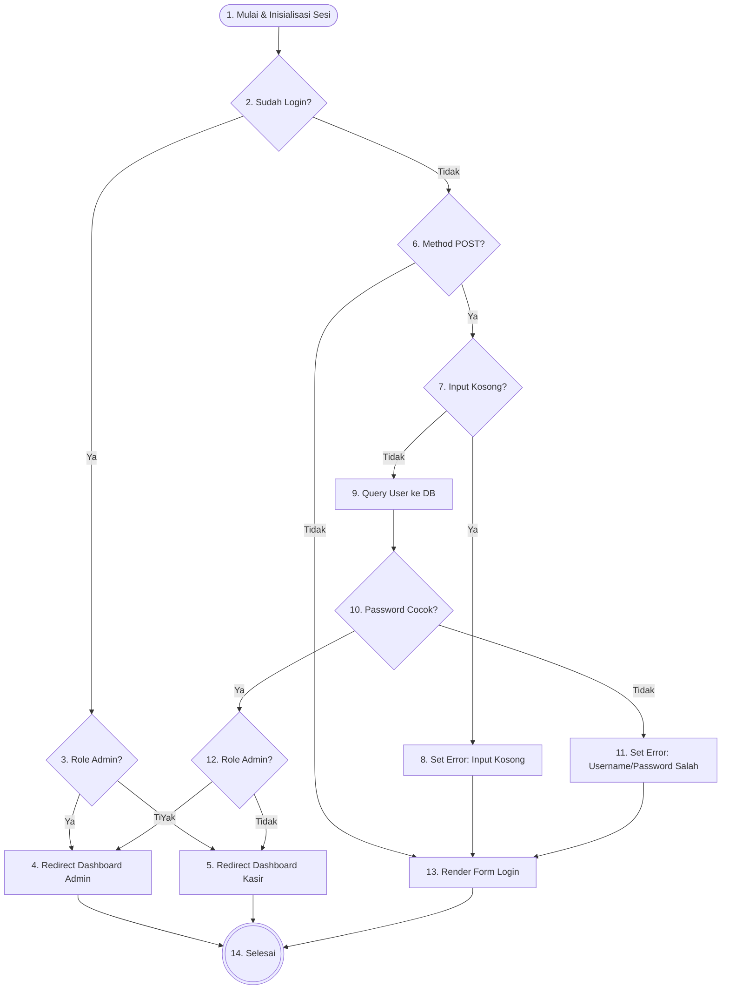
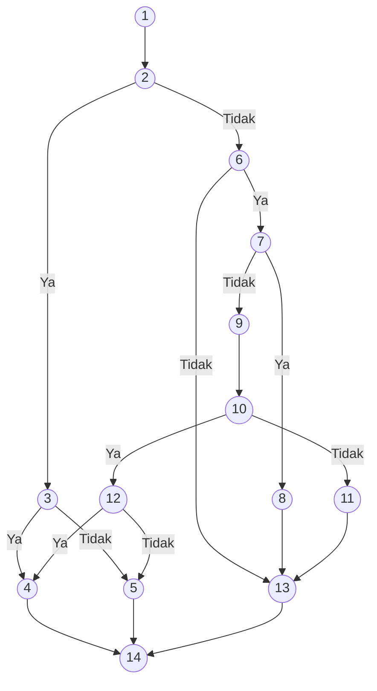
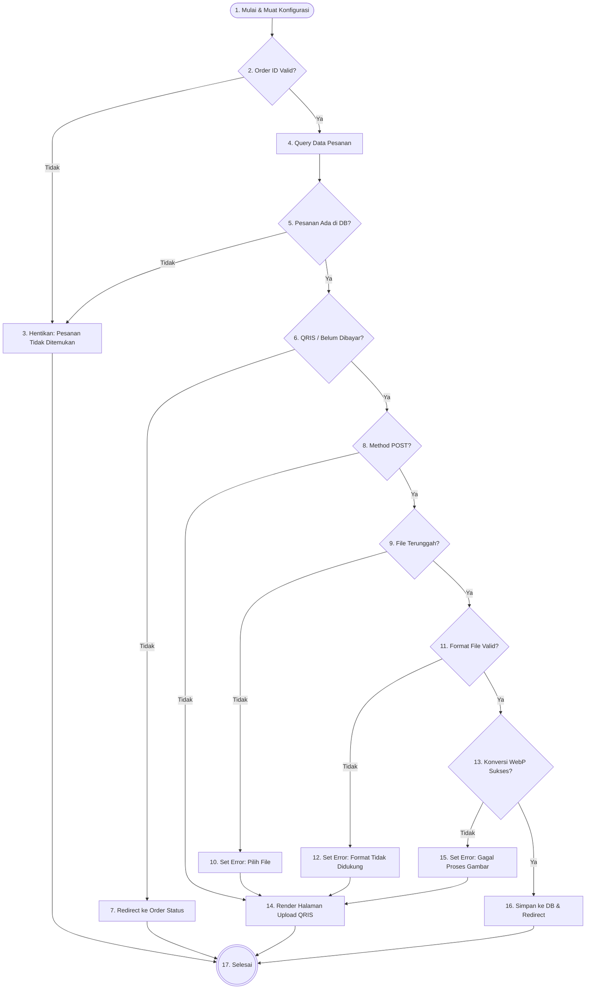
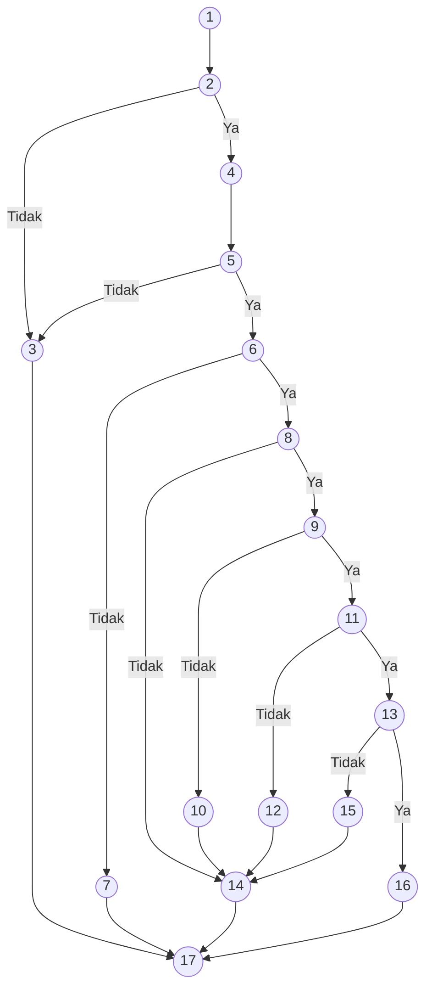
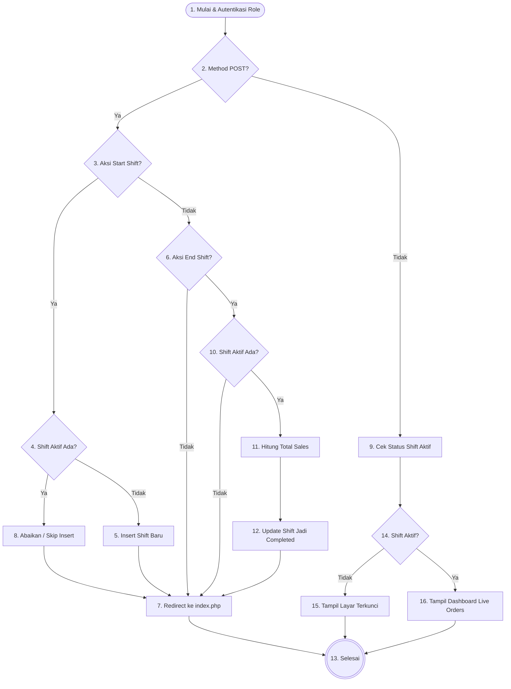
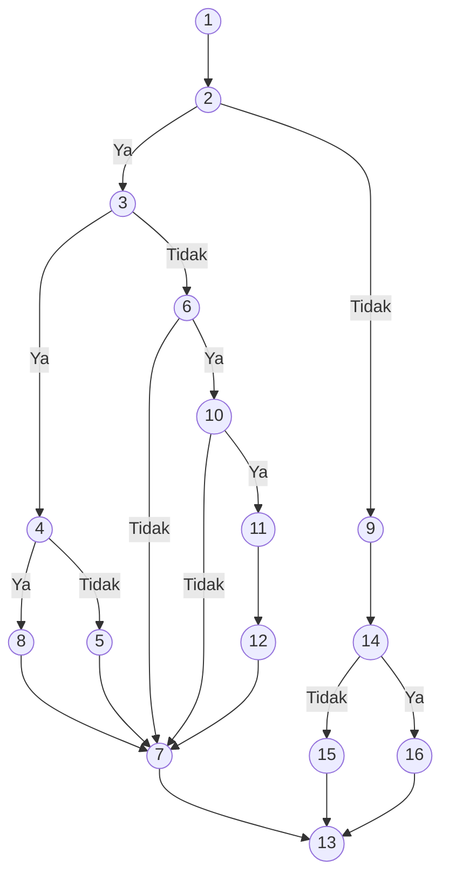

# Dokumen Pengujian White Box (Sistem Pemesanan Cafe AK)

Dokumen ini berisi pengujian *White Box* untuk tiga fitur utama pada sistem pemesanan Cafe AK:
1. **Proses Login Multi-Role (`auth/login.php`)**
2. **Modul Pelanggan – Konfirmasi Pembayaran QRIS (`customer/qris_payment.php`)**
3. **Modul Kasir – Manajemen Shift (`kasir/index.php`)**

---

## 🔑 1. Pengujian White Box: Login (`auth/login.php`)

### A. Flowchart & Flowgraph

#### 📊 Flowchart Proses Login

#### 📈 Flowgraph

### B. Tabel Keterangan Node

| Node | Logika / Kode | Deskripsi |
| :--- | :--- | :--- |
| **Node 1** | `session_status() === PHP_SESSION_NONE` `{ session_start(); }` (auth/login.php : 2–6) | Memulai sesi PHP dan memuat konfigurasi database & autentikasi. |
| **Node 2** | `if (isLoggedIn())` (auth/login.php : 9) | Guard: Pengecekan apakah pengguna sudah memiliki sesi login aktif. |
| **Node 3** | `if ($_SESSION['user_role'] === 'admin')` (auth/login.php : 10) | Pengecekan role pengguna yang sudah login untuk menentukan arah redirect. |
| **Node 4** | `header("Location: ../admin/index.php"); exit;` (auth/login.php : 11, 44) | Redirect pengguna ke halaman dashboard Admin. |
| **Node 5** | `header("Location: ../kasir/index.php"); exit;` (auth/login.php : 13, 46) | Redirect pengguna ke halaman dashboard Kasir. |
| **Node 6** | `if ($_SERVER['REQUEST_METHOD'] === 'POST')` (auth/login.php : 20) | Pengecekan apakah form login dikirimkan via method POST. |
| **Node 7** | `if (empty($username) \|\| empty($password))` (auth/login.php : 25) | Pengecekan apakah input *username* atau *password* kosong. |
| **Node 8** | `$error = 'Username dan password wajib diisi.';` (auth/login.php : 26) | Menetapkan pesan error validasi input kosong. |
| **Node 9** | `$stmt->execute(['username' => $username]); $user = $stmt->fetch();` (auth/login.php : 29–31) | Eksekusi query ke database untuk mencari data user berdasarkan username. |
| **Node 10** | `if ($user && password_verify($password, $user['password']))` (auth/login.php : 33) | Pengecekan kecocokan password menggunakan fungsi `password_verify()`. |
| **Node 11** | `$error = 'Username atau password salah.';` (auth/login.php : 50) | Menetapkan pesan error karena user tidak ditemukan atau password salah. |
| **Node 12** | `if ($user['role'] === 'admin')` (auth/login.php : 43) | Pengecekan role pengguna yang berhasil login untuk menentukan arah redirect. |
| **Node 13** | Render HTML form login (auth/login.php : 59–125) | Menampilkan halaman form login beserta pesan error jika ada. |
| **Node 14** | Akhir eksekusi script PHP (auth/login.php : 126) | Selesai: eksekusi selesai, baik setelah redirect maupun render halaman. |

### C. Perhitungan Cyclomatic Complexity (CC) & Jumlah Region

* **Jumlah Sisi (Edges, E)** = 18
* **Jumlah Node (N)** = 14
* **Rumus**: $V(G) = E - N + 2$
* **Perhitungan**: $V(G) = 18 - 14 + 2 = 6$

Metode *Predicate Node* (Node Keputusan):
* Terdapat 5 Predicate Node (Node 2, 3, 6, 7, 10, dan 12).
* **Rumus**: $V(G) = P + 1$
* **Perhitungan**: $V(G) = 5 + 1 = 6$

**Jumlah Region (Daerah)**:
* **Jumlah Region = 6** (Terdapat 5 area tertutup di dalam graf dan 1 area terbuka di luar graf).

*Maka, terdapat **6 Jalur Independen** dalam proses login.*

### D. Jalur Independen (Independent Paths)

1. **Path 1 (Sudah Login – Role Admin)**:
   `1 -> 2 -> 3 -> 4 -> 14`
2. **Path 2 (Sudah Login – Role Kasir)**:
   `1 -> 2 -> 3 -> 5 -> 14`
3. **Path 3 (GET Request – Tampil Form)**:
   `1 -> 2 -> 6 -> 13 -> 14`
4. **Path 4 (POST, Input Kosong)**:
   `1 -> 2 -> 6 -> 7 -> 8 -> 13 -> 14`
5. **Path 5 (POST, Username/Password Salah)**:
   `1 -> 2 -> 6 -> 7 -> 9 -> 10 -> 11 -> 13 -> 14`
6. **Path 6 (POST, Login Sukses)**:
   `1 -> 2 -> 6 -> 7 -> 9 -> 10 -> 12 -> 4/5 -> 14`

### E. Tabel Kasus Uji (Test Case)

**File Referensi: `auth/login.php`**

| No | Input / Event | Fungsi yang Diuji | Output yang Diharapkan | Hasil Uji |
| :--: | :--- | :--- | :--- | :--: |
| 1 | Pengguna sudah login sebagai admin, membuka halaman login | Pengecekan Sesi Aktif & Role (`isLoggedIn()`) (auth/login.php : 9–15) | Langsung diarahkan ke halaman `admin/index.php` tanpa menampilkan form login | Lulus |
| 2 | Pengguna sudah login sebagai kasir, membuka halaman login | Pengecekan Sesi Aktif & Role (`isLoggedIn()`) (auth/login.php : 9–15) | Langsung diarahkan ke halaman `kasir/index.php` tanpa menampilkan form login | Lulus |
| 3 | Membuka halaman login tanpa sesi aktif (GET Request) | Render Form Login (auth/login.php : 59–125) | Halaman form login ditampilkan tanpa pesan error | Lulus |
| 4 | Username dikosongkan, password dikosongkan, klik Login | Validasi Input Kosong (auth/login.php : 25–26) | Tampil pesan error: **"Username dan password wajib diisi."** di halaman login | Lulus |
| 5 | Username tidak terdaftar di database, klik Login | Verifikasi Kredensial `password_verify()` (auth/login.php : 33–51) | Tampil pesan error: **"Username atau password salah."** di halaman login | Lulus |
| 6 | Username terdaftar, password salah, klik Login | Verifikasi Kata Sandi Bcrypt `password_verify()` (auth/login.php : 33–51) | Tampil pesan error: **"Username atau password salah."** di halaman login | Lulus |
| 7 | Username & password admin benar, klik Login | Login Sukses & Redirect Role Admin (auth/login.php : 43–44) | Sesi berhasil dibuat, pengguna diarahkan ke `admin/index.php` | Lulus |
| 8 | Username & password kasir benar, klik Login | Login Sukses & Redirect Role Kasir (auth/login.php : 45–47) | Sesi berhasil dibuat, pengguna diarahkan ke `kasir/index.php` | Lulus |

---

## 📱 2. Pengujian White Box: Modul Pelanggan – Kode QR (`customer/qris_payment.php`)

### A. Flowchart & Flowgraph

#### 📊 Flowchart Proses Upload Bukti QRIS

#### 📈 Flowgraph

### B. Tabel Keterangan Node

| Node | Logika / Kode | Deskripsi |
| :--- | :--- | :--- |
| **Node 1** | `require_once '../config/db.php';` (customer/qris_payment.php : 2) | Memuat konfigurasi database dan menginisialisasi variabel. |
| **Node 2** | `$orderId = isset($_GET['id']) ? (int)$_GET['id'] : 0; if ($orderId === 0)` (customer/qris_payment.php : 4–6) | Pengecekan apakah parameter ID pesanan tersedia dan valid. |
| **Node 3** | `die("Pesanan tidak ditemukan.");` (customer/qris_payment.php : 6, 15) | Menghentikan eksekusi jika ID tidak valid atau pesanan tidak ada di database. |
| **Node 4** | `$stmt->execute([$orderId]); $order = $stmt->fetch();` (customer/qris_payment.php : 10–12) | Menjalankan query untuk mengambil data pesanan dari tabel `orders`. |
| **Node 5** | `if (!$order)` (customer/qris_payment.php : 14) | Pengecekan apakah data pesanan ditemukan di database. |
| **Node 6** | `if ($order['metode_bayar'] !== 'qris' \|\| $order['status_bayar'] === 'paid')` (customer/qris_payment.php : 19) | Pengecekan metode pembayaran dan status apakah masih perlu upload bukti. |
| **Node 7** | `header("Location: order_status.php?id=" . $orderId); exit;` (customer/qris_payment.php : 20–21) | Redirect ke halaman status pesanan jika bukan metode QRIS atau sudah dibayar. |
| **Node 8** | `if ($_SERVER['REQUEST_METHOD'] === 'POST')` (customer/qris_payment.php : 28) | Pengecekan apakah pengguna mengirimkan form upload (method POST). |
| **Node 9** | `if (isset($_FILES['bukti_transfer']) && $_FILES['bukti_transfer']['error'] === UPLOAD_ERR_OK)` (customer/qris_payment.php : 29) | Pengecekan apakah file berhasil diunggah ke server tanpa error. |
| **Node 10** | `$error = 'Silakan pilih gambar bukti transfer terlebih dahulu.';` (customer/qris_payment.php : 67) | Menetapkan pesan error jika tidak ada file yang dipilih. |
| **Node 11** | `if (in_array($fileExt, $allowedExts) && in_array($mime, $allowedMimes))` (customer/qris_payment.php : 41) | Pengecekan apakah ekstensi dan MIME type file termasuk format yang diizinkan. |
| **Node 12** | `$error = 'Format file tidak didukung. Harap gunakan gambar JPG, PNG, atau WEBP.';` (customer/qris_payment.php : 64) | Menetapkan pesan error jika format file tidak valid. |
| **Node 13** | `if (convertToWebp($fileTmp, $destPath))` (customer/qris_payment.php : 51) | Pengecekan apakah konversi gambar ke format WebP berhasil. |
| **Node 14** | Render HTML halaman upload QRIS (customer/qris_payment.php : 71–179) | Menampilkan antarmuka halaman upload QRIS, kode QR, dan pesan error jika ada. |
| **Node 15** | `$error = 'Gagal memproses gambar bukti transfer.';` (customer/qris_payment.php : 61) | Menetapkan pesan error jika proses konversi gambar ke WebP gagal. |
| **Node 16** | `$stmtUpd->execute([$dbPath, $orderId]); header("Location: order_status.php?id=" . $orderId); exit;` (customer/qris_payment.php : 55–59) | Menyimpan path bukti transfer ke DB, lalu redirect ke halaman status pesanan. |
| **Node 17** | Akhir eksekusi (customer/qris_payment.php : 180) | Selesai: pengguna diarahkan ke halaman status atau tetap di halaman upload. |

### C. Perhitungan Cyclomatic Complexity (CC) & Jumlah Region

* **Jumlah Sisi (Edges, E)** = 22
* **Jumlah Node (N)** = 17
* **Rumus**: $V(G) = E - N + 2$
* **Perhitungan**: $V(G) = 22 - 17 + 2 = 7$

Metode *Predicate Node* (Node Keputusan):
* Terdapat 6 Predicate Node: Node 2, 5, 6, 8, 9, 11, dan 13.
* **Rumus**: $V(G) = P + 1$
* **Perhitungan**: $V(G) = 6 + 1 = 7$

**Jumlah Region (Daerah)**:
* **Jumlah Region = 7** (Terdapat 6 area tertutup di dalam graf dan 1 area terbuka di luar graf).

*Maka, terdapat **7 Jalur Independen** dalam modul pelanggan QRIS.*

### D. Jalur Independen (Independent Paths)

1. **Path 1 (Order ID Tidak Valid)**:
   `1 -> 2 -> 3 -> 17`
2. **Path 2 (Order Tidak Ditemukan di DB)**:
   `1 -> 2 -> 4 -> 5 -> 3 -> 17`
3. **Path 3 (Bukan Metode QRIS / Sudah Dibayar)**:
   `1 -> 2 -> 4 -> 5 -> 6 -> 7 -> 17`
4. **Path 4 (GET Request – Tampil Halaman Upload)**:
   `1 -> 2 -> 4 -> 5 -> 6 -> 8 -> 14 -> 17`
5. **Path 5 (POST, File Tidak Dipilih)**:
   `1 -> 2 -> 4 -> 5 -> 6 -> 8 -> 9 -> 10 -> 14 -> 17`
6. **Path 6 (POST, Format File Tidak Valid)**:
   `1 -> 2 -> 4 -> 5 -> 6 -> 8 -> 9 -> 11 -> 12 -> 14 -> 17`
7. **Path 7 (POST, File Valid, Konversi Gagal)**:
   `1 -> 2 -> 4 -> 5 -> 6 -> 8 -> 9 -> 11 -> 13 -> 15 -> 14 -> 17`
8. **Path 8 (POST, File Valid, Upload Sukses)**:
   `1 -> 2 -> 4 -> 5 -> 6 -> 8 -> 9 -> 11 -> 13 -> 16 -> 17`

### E. Tabel Kasus Uji (Test Case)

**File Referensi: `customer/qris_payment.php`**

| No | Input / Event | Fungsi yang Diuji | Output yang Diharapkan | Hasil Uji |
| :--: | :--- | :--- | :--- | :--: |
| 1 | Akses URL tanpa parameter `?id=` atau `?id=0` | Validasi Order ID (`$orderId === 0`) (customer/qris_payment.php : 4–6) | Halaman berhenti dengan pesan **"Pesanan tidak ditemukan."** | Lulus |
| 2 | Akses URL dengan `?id=9999` (ID tidak ada di DB) | Query Pesanan ke DB (customer/qris_payment.php : 10–15) | Halaman berhenti dengan pesan **"Pesanan tidak ditemukan."** | Lulus |
| 3 | Akses URL dengan ID pesanan yang metode bayarnya bukan QRIS atau sudah `paid` | Pengecekan Metode & Status Bayar (customer/qris_payment.php : 19–21) | Pengguna langsung diarahkan ke halaman `order_status.php` | Lulus |
| 4 | Akses URL dengan ID pesanan QRIS yang valid (GET Request) | Render Halaman Upload QRIS (customer/qris_payment.php : 71–179) | Halaman upload beserta kode QRIS dan form unggah bukti ditampilkan | Lulus |
| 5 | Klik tombol Selesai tanpa memilih file gambar | Pengecekan File Upload (`UPLOAD_ERR_OK`) (customer/qris_payment.php : 29, 67) | Tampil pesan error: **"Silakan pilih gambar bukti transfer terlebih dahulu."** | Lulus |
| 6 | Upload file berformat `.pdf` atau `.gif` | Validasi Ekstensi & MIME Type (customer/qris_payment.php : 34–41, 64) | Tampil pesan error: **"Format file tidak didukung. Harap gunakan gambar JPG, PNG, atau WEBP."** | Lulus |
| 7 | Upload file gambar yang rusak/korup (tidak bisa dikonversi) | Konversi WebP `convertToWebp()` (customer/qris_payment.php : 51, 61) | Tampil pesan error: **"Gagal memproses gambar bukti transfer."** | Lulus |
| 8 | Upload file gambar JPG/PNG/WEBP yang valid | Simpan ke DB & Redirect (customer/qris_payment.php : 55–59) | Data bukti transfer tersimpan di DB, pengguna diarahkan ke `order_status.php` | Lulus |

---

## 🖥️ 3. Pengujian White Box: Modul Kasir – Manajemen Shift (`kasir/index.php`)

### A. Flowchart & Flowgraph

#### 📊 Flowchart Proses Manajemen Shift Kasir

#### 📈 Flowgraph

### B. Tabel Keterangan Node

| Node | Logika / Kode | Deskripsi |
| :--- | :--- | :--- |
| **Node 1** | `require_once '../config/auth.php'; requireRole('kasir');` (kasir/index.php : 2–4) | Memuat konfigurasi autentikasi dan memastikan hanya role `kasir` yang bisa akses. |
| **Node 2** | `if ($_SERVER['REQUEST_METHOD'] === 'POST')` (kasir/index.php : 9) | Pengecekan apakah ada permintaan POST (aksi start/end shift). |
| **Node 3** | `if (isset($_POST['start_shift']))` (kasir/index.php : 11) | Pengecekan apakah aksi yang dilakukan adalah memulai shift. |
| **Node 4** | `$stmt->execute([$kasir_id]); if (!$stmt->fetch())` (kasir/index.php : 13–15) | Mengecek apakah sudah ada shift aktif untuk kasir ini di database. |
| **Node 5** | `$pdo->prepare("INSERT INTO shifts (kasir_id) VALUES (?)")->execute([$kasir_id]);` (kasir/index.php : 16) | Menyisipkan record shift baru ke tabel `shifts` jika belum ada. |
| **Node 6** | `elseif (isset($_POST['end_shift']))` (kasir/index.php : 18) | Pengecekan apakah aksi yang dilakukan adalah mengakhiri shift. |
| **Node 7** | `header("Location: index.php"); exit;` (kasir/index.php : 37–38) | Redirect kembali ke halaman dashboard kasir setelah proses POST selesai. |
| **Node 8** | *(kondisi `!$stmt->fetch()` bernilai false)* (kasir/index.php : 15) | Tidak ada insert dilakukan karena shift aktif sudah ada (skip). |
| **Node 9** | `$stmt->execute([$kasir_id]); $isActiveShift = $stmt->fetch();` (kasir/index.php : 42–44) | Query untuk mengecek status shift aktif kasir saat ini pada GET request. |
| **Node 10** | `$isActiveShift = $stmt->fetch(); if ($isActiveShift)` (kasir/index.php : 22–24) | Pengecekan apakah terdapat shift aktif yang bisa diakhiri. |
| **Node 11** | `$stmtSales->execute([$shift_id]); $calculatedTotalSales = $stmtSales->fetchColumn();` (kasir/index.php : 28–30) | Menghitung total sales dari pesanan yang selesai dan dibayar pada shift ini. |
| **Node 12** | `$stmtClose->execute([$calculatedTotalSales, $shift_id]);` (kasir/index.php : 33–34) | Menutup shift dengan mengupdate `end_time`, `total_sales`, dan `status` menjadi `completed`. |
| **Node 13** | Akhir eksekusi (kasir/index.php : 45–199) | Selesai: eksekusi selesai setelah redirect atau render halaman dashboard. |
| **Node 14** | `if (!$isActiveShift)` (kasir/index.php : 143) | Pengecekan apakah kasir saat ini memiliki shift aktif untuk menentukan tampilan. |
| **Node 15** | Render layar terkunci (kasir/index.php : 144–158) | Menampilkan overlay layar terkunci beserta tombol "Mulai Shift Saya". |
| **Node 16** | Render dashboard Live Orders (kasir/index.php : 161–170) | Menampilkan grid live orders dan kontrol shift aktif (End Shift, Enable Audio). |

### C. Perhitungan Cyclomatic Complexity (CC) & Jumlah Region

* **Jumlah Sisi (Edges, E)** = 22
* **Jumlah Node (N)** = 16
* **Rumus**: $V(G) = E - N + 2$
* **Perhitungan**: $V(G) = 22 - 16 + 2 = 8$

Metode *Predicate Node* (Node Keputusan):
* Terdapat 7 Predicate Node: Node 2, 3, 4, 6, 10, dan 14.
* **Rumus**: $V(G) = P + 1$
* **Perhitungan**: $V(G) = 6 + 1 = 7$

> Nilai CC diambil dari hasil terbesar: **CC = 8**.

**Jumlah Region (Daerah)**:
* **Jumlah Region = 8** (Terdapat 7 area tertutup di dalam graf dan 1 area terbuka di luar graf).

*Maka, terdapat **8 Jalur Independen** dalam modul kasir.*

### D. Jalur Independen (Independent Paths)

1. **Path 1 (GET – Shift Belum Aktif)**:
   `1 -> 2 -> 9 -> 14 -> 15 -> 13`
2. **Path 2 (GET – Shift Sudah Aktif)**:
   `1 -> 2 -> 9 -> 14 -> 16 -> 13`
3. **Path 3 (POST Start Shift – Belum Ada Shift Aktif)**:
   `1 -> 2 -> 3 -> 4 -> 5 -> 7 -> 13`
4. **Path 4 (POST Start Shift – Shift Aktif Sudah Ada)**:
   `1 -> 2 -> 3 -> 4 -> 8 -> 7 -> 13`
5. **Path 5 (POST End Shift – Tidak Ada Shift Aktif)**:
   `1 -> 2 -> 3 -> 6 -> 10 -> 7 -> 13`
6. **Path 6 (POST End Shift – Shift Aktif Ada, Tutup Sukses)**:
   `1 -> 2 -> 3 -> 6 -> 10 -> 11 -> 12 -> 7 -> 13`
7. **Path 7 (POST Aksi Lain Selain Start/End)**:
   `1 -> 2 -> 3 -> 6 -> 7 -> 13`
8. **Path 8 (Role Tidak Valid – Akses Ditolak)**:
   `1 -> 13` *(requireRole() melempar redirect/error sebelum lanjut)*

### E. Tabel Kasus Uji (Test Case)

**File Referensi: `kasir/index.php`**

| No | Input / Event | Fungsi yang Diuji | Output yang Diharapkan | Hasil Uji |
| :--: | :--- | :--- | :--- | :--: |
| 1 | Pengguna dengan role selain `kasir` mengakses halaman | Role Guard `requireRole('kasir')` (kasir/index.php : 4) | Pengguna diarahkan ke halaman login atau halaman error akses ditolak | Lulus |
| 2 | Kasir login dan belum memulai shift (GET Request) | Render Layar Terkunci (kasir/index.php : 143–158) | Halaman menampilkan overlay layar terkunci dan tombol **"Mulai Shift Saya"** | Lulus |
| 3 | Kasir login dan sudah memiliki shift aktif (GET Request) | Render Dashboard Live Orders (kasir/index.php : 161–170) | Halaman menampilkan grid live orders, tombol **"End Shift"** dan **"Enable Audio"** | Lulus |
| 4 | Kasir klik tombol "Mulai Shift Saya" (belum ada shift aktif) | Insert Shift Baru ke DB (kasir/index.php : 13–16) | Record shift baru berhasil diinsert ke tabel `shifts`, halaman di-refresh, status jadi Online | Lulus |
| 5 | Kasir klik tombol "Mulai Shift Saya" (shift aktif sudah ada) | Cek Duplikasi Shift Aktif (kasir/index.php : 13–15) | Tidak ada insert duplikasi, halaman di-refresh, status tetap Online | Lulus |
| 6 | Kasir klik "End Shift", tidak ada shift aktif di DB | Pengecekan Shift Aktif Saat End (kasir/index.php : 20–22) | Tidak ada pembaruan DB, halaman di-redirect ke `index.php` tanpa error | Lulus |
| 7 | Kasir klik "End Shift", konfirmasi Ya, ada shift aktif | Hitung Total Sales & Tutup Shift (kasir/index.php : 24–34) | Total sales dihitung dari pesanan `paid` & `selesai`, shift ditutup (`status=completed`), halaman di-refresh | Lulus |
| 8 | Kasir klik "End Shift", konfirmasi Tidak | Konfirmasi JS `confirm()` (kasir/index.php : 132) | Form tidak terkirim, kasir tetap berada di halaman dashboard dengan shift masih aktif | Lulus |
