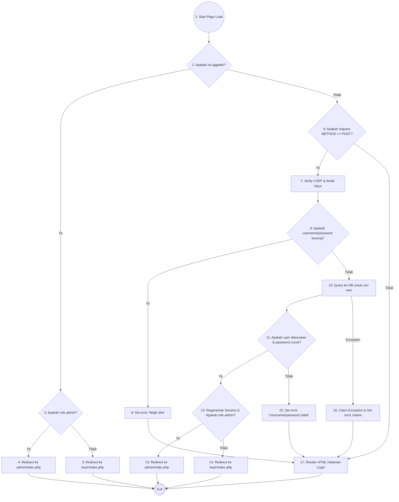
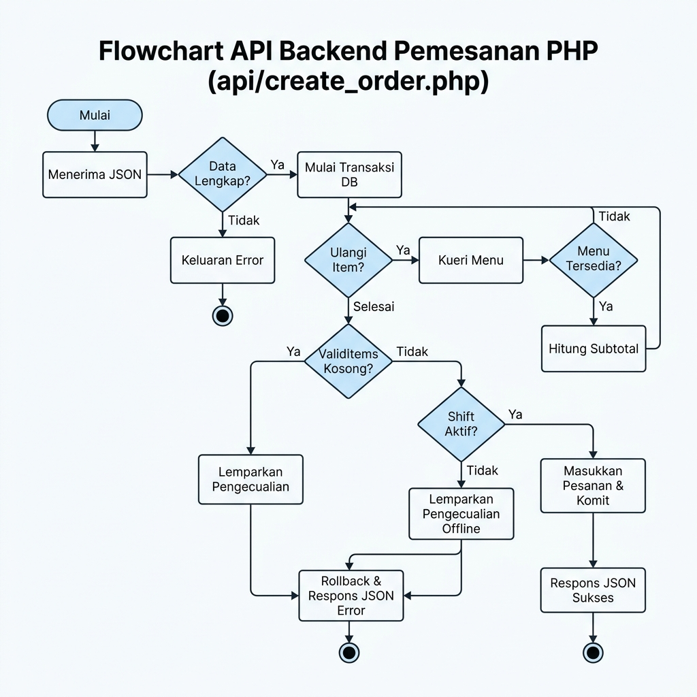
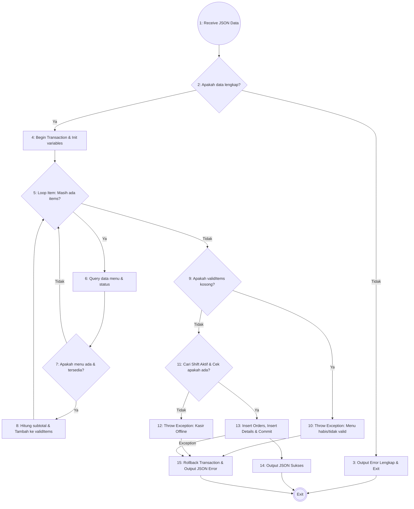
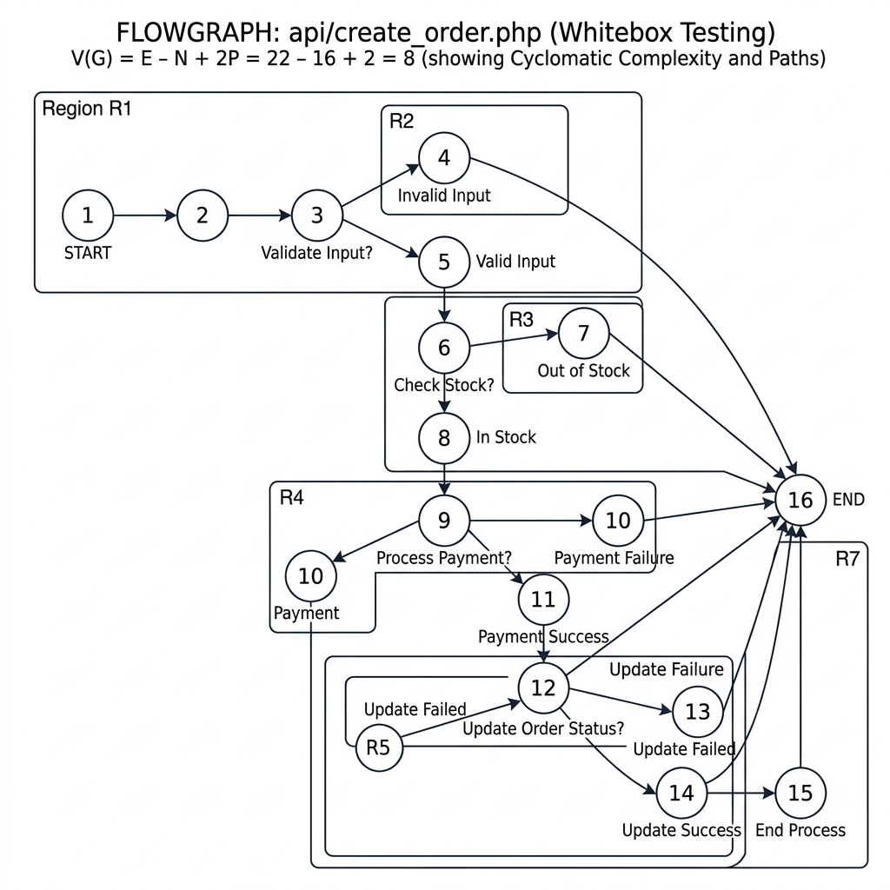
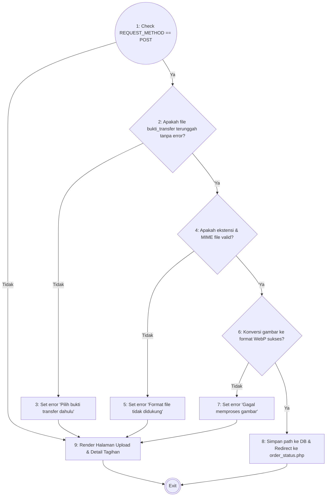

# Dokumen Pengujian White Box (Sistem Pemesanan Cafe AK)

Dokumen ini berisi pengujian *White Box* untuk tiga fitur utama pada sistem pemesanan Cafe AK:
1. **Proses Login Multi-Role (`auth/login.php`)**
2. **Proses Checkout Pelanggan (`api/create_order.php`)**
3. **Proses Konfirmasi Pembayaran QRIS (`customer/qris_payment.php`)**

---

## 🔑 1. Pengujian White Box: Login (`auth/login.php`)

### A. Flowchart & Flowgraph
Alur logika backend pada script login didefinisikan ke dalam bagan alur (*flowchart*) dan graf alur (*flowgraph*) berikut:

### B. Tabel Keterangan Node
| Node | Deskripsi |
| :--- | :--- |
| **1** | Memulai load halaman login, inisialisasi session. |
| **2** | Pengecekan kondisi: `isLoggedIn()`. |
| **3** | Pengecekan kondisi: `$_SESSION['user_role'] === 'admin'`. |
| **4** | Eksekusi redirect ke `../admin/index.php` bagi user yang sudah login sebagai admin. |
| **5** | Eksekusi redirect ke `../kasir/index.php` bagi user yang sudah login sebagai kasir. |
| **6** | Pengecekan kondisi: `$_SERVER['REQUEST_METHOD'] === 'POST'`. |
| **7** | Eksekusi verifikasi CSRF token, pembersihan spasi username dan pengambilan data password. |
| **8** | Pengecekan kondisi: `empty($username) || empty($password)`. |
| **9** | Penentuan nilai `$error = 'Username dan password wajib diisi.'`. |
| **10** | Eksekusi Query pencarian user di database: `SELECT * FROM users WHERE username = :username`. |
| **11** | Pengecekan kondisi: `$user` ditemukan dan `password_verify($password, $user['password'])` bernilai true. |
| **12** | Eksekusi `session_regenerate_id()`, setup session role, dan cek kondisi `role === 'admin'`. |
| **13** | Eksekusi redirect ke `../admin/index.php` setelah sukses login admin. |
| **14** | Eksekusi redirect ke `../kasir/index.php` setelah sukses login kasir. |
| **15** | Penentuan nilai `$error = 'Username atau password salah.'`. |
| **16** | Blok catch: Menangani error database (PDOException) dan set pesan error sistem. |
| **17** | Merender tampilan halaman HTML login dengan form input serta pesan error jika ada. |

### C. Perhitungan Cyclomatic Complexity (CC)
Berdasarkan rumus kompleksitas siklomatis graf alur $G$:
* **Jumlah Sisi (Edges, E)** = 24
* **Jumlah Node (N)** = 18 (termasuk Exit)
* **Rumus**: $V(G) = E - N + 2$
* **Perhitungan**: $V(G) = 24 - 18 + 2 = 8$

Metode Predicate Node ($V(G) = P + 1$ di mana $P$ adalah node keputusan):
1. Node 2 (`isLoggedIn()`)
2. Node 3 (`role === 'admin'`)
3. Node 6 (`REQUEST_METHOD === 'POST'`)
4. Node 8 (`empty(username) || empty(password)`)
5. Node 10 (Try/Catch - Database Error check)
6. Node 11 (`user ditemukan & password cocok`)
7. Node 12 (`role === 'admin'` sesudah login)
* **Jumlah Predikat (P)** = 7
* **Perhitungan**: $V(G) = 7 + 1 = 8$

*Maka, terdapat **8 Jalur Independen**.*

### D. Jalur Independen (Independent Paths)
1. **Jalur 1**: 1 - 2 (Ya) - 3 (Ya) - 4 - Exit
2. **Jalur 2**: 1 - 2 (Ya) - 3 (Tidak) - 5 - Exit
3. **Jalur 3**: 1 - 2 (Tidak) - 6 (Tidak) - 17 - Exit
4. **Jalur 4**: 1 - 2 (Tidak) - 6 (Ya) - 7 - 8 (Ya) - 9 - 17 - Exit
5. **Jalur 5**: 1 - 2 (Tidak) - 6 (Ya) - 7 - 8 (Tidak) - 10 (Exception) - 16 - 17 - Exit
6. **Jalur 6**: 1 - 2 (Tidak) - 6 (Ya) - 7 - 8 (Tidak) - 10 (Sukses) - 11 (Tidak) - 15 - 17 - Exit
7. **Jalur 7**: 1 - 2 (Tidak) - 6 (Ya) - 7 - 8 (Tidak) - 10 (Sukses) - 11 (Ya) - 12 (Ya) - 13 - Exit
8. **Jalur 8**: 1 - 2 (Tidak) - 6 (Ya) - 7 - 8 (Tidak) - 10 (Sukses) - 11 (Ya) - 12 (Tidak) - 14 - Exit

---

## 🛒 2. Pengujian White Box: Checkout Pelanggan (`api/create_order.php`)

### A. Flowchart & Flowgraph
Alur checkout ketika pelanggan mengirim data pesanan (format JSON) ke API backend didefinisikan ke dalam bagan alur (*flowchart*) dan graf alur (*flowgraph*) berikut:

#### 📊 Flowchart

#### 📈 Flowgraph

### B. Tabel Keterangan Node
| Node / Logika | Deskripsi |
| :--- | :--- |
| **1** | Menerima data input JSON dari client side (`meja_id`, `metode_bayar`, `uang_dibayar`, `items`). |
| **2** | Pengecekan kondisi kelengkapan data: `!$data || empty(meja_id) || empty(items) || empty(metode_bayar)`. |
| **3** | Mengirim output error "Data pesanan tidak lengkap" dan memberhentikan script. |
| **4** | Memulai transaksi database PDO (`beginTransaction`), menetapkan `$totalHarga = 0` dan `$validItems = []`. |
| **5** | Perulangan item (`foreach ($items as $item)`): Pengecekan apakah masih ada item dalam daftar pesanan. |
| **6** | Eksekusi query mengambil data harga dan status keaktifan menu dari tabel `menus`. |
| **7** | Pengecekan kondisi: Apakah menu ditemukan dan berstatus `'tersedia'`. |
| **8** | Menghitung subtotal per item, menambahkan subtotal ke total harga, dan memasukkan item ke array `$validItems`. |
| **9** | Pengecekan kondisi: Apakah array `$validItems` bernilai kosong. |
| **10** | Lempar Exception: "Semua item pesanan tidak valid atau stok habis." |
| **11** | Eksekusi pencarian shift kasir aktif dan mengecek apakah terdapat shift kasir bernilai aktif (`$activeShift`). |
| **12** | Lempar Exception: "Mohon maaf, kasir sedang offline." |
| **13** | Eksekusi insert data ke tabel `orders` dan `order_details`, serta melakukan `commit` transaksi. |
| **14** | Mengirim output JSON sukses: `success => true` dan ID pesanan. |
| **15** | Blok catch: Melakukan `rollBack` transaksi database dan mengirimkan pesan error sebagai response JSON. |

### C. Perhitungan Cyclomatic Complexity (CC) & Jumlah Region
* **Jumlah Sisi (Edges, E)** = 21
* **Jumlah Node (N)** = 16 (termasuk Exit)
* **Rumus**: $V(G) = E - N + 2$
* **Perhitungan**: $V(G) = 21 - 16 + 2 = 7$

Metode Predicate Node ($V(G) = P + 1$ di mana $P$ adalah node keputusan):
1. Node 2 (Cek kelengkapan parameter)
2. Node 5 (Looping item pesanan)
3. Node 7 (Cek menu ada & tersedia)
4. Node 9 (Cek validItems kosong)
5. Node 11 (Cek ketersediaan shift aktif)
6. Node 13 (Exception check saat insert database)
* **Jumlah Predikat (P)** = 6
* **Perhitungan**: $V(G) = 6 + 1 = 7$

* **Jumlah Region (Daerah)** = **7 Region**
  * *Region 1 s.d. 6*: Wilayah/area tertutup yang dibatasi oleh siklus lintasan graf alur.
  * *Region 7*: Wilayah luar di sekeliling graf alur (open area).

*Maka, terdapat **7 Jalur Independen**.*

### D. Jalur Independen (Independent Paths)
1. **Jalur 1**: 1 - 2 (Tidak) - 3 - Exit
2. **Jalur 2**: 1 - 2 (Ya) - 4 - 5 (Selesai loop langsung) - 9 (Ya) - 10 - 15 - Exit
3. **Jalur 3**: 1 - 2 (Ya) - 4 - 5 (Looping item) - 6 - 7 (Tidak) - 5 (Selesai loop) - 9 (Ya) - 10 - 15 - Exit
4. **Jalur 4**: 1 - 2 (Ya) - 4 - 5 (Looping item) - 6 - 7 (Ya) - 8 - 5 (Selesai loop) - 9 (Tidak) - 11 (Tidak) - 12 - 15 - Exit
5. **Jalur 5**: 1 - 2 (Ya) - 4 - 5 (Looping item) - 6 - 7 (Ya) - 8 - 5 (Selesai loop) - 9 (Tidak) - 11 (Ya) - 13 (Sukses) - 14 - Exit
6. **Jalur 6**: 1 - 2 (Ya) - 4 - 5 (Looping item) - 6 - 7 (Ya) - 8 - 5 (Selesai loop) - 9 (Tidak) - 11 (Ya) - 13 (Exception saat insert) - 15 - Exit
7. **Jalur 7**: 1 - 2 (Ya) - 4 - 5 (Looping item pertama) - 6 - 7 (Tidak) - 5 (Looping item kedua) - 6 - 7 (Ya) - 8 - 5 (Selesai) - 9 (Tidak) - 11 (Ya) - 13 (Sukses) - 14 - Exit

---

## 📸 3. Pengujian White Box: Konfirmasi Pembayaran QRIS (`customer/qris_payment.php`)

### A. Flowchart & Flowgraph
Alur upload bukti transfer oleh pelanggan pada halaman konfirmasi pembayaran:

### B. Tabel Keterangan Node
| Node | Deskripsi |
| :--- | :--- |
| **1** | Pengecekan kondisi: Apakah user mengirimkan form (`$_SERVER['REQUEST_METHOD'] === 'POST'`). |
| **2** | Pengecekan kondisi: `isset($_FILES['bukti_transfer']) && error === UPLOAD_ERR_OK`. |
| **3** | Penentuan nilai error: "Silakan pilih gambar bukti transfer terlebih dahulu." |
| **4** | Pengecekan kondisi: Apakah ekstensi file ada dalam array `allowedExts` dan mime-type sesuai dengan `allowedMimes`. |
| **5** | Penentuan nilai error: "Format file tidak didukung. Harap gunakan gambar JPG, PNG, atau WEBP." |
| **6** | Eksekusi pemanggilan helper image `convertToWebp($fileTmp, $destPath)` dan mengecek nilai kembaliannya. |
| **7** | Penentuan nilai error: "Gagal memproses gambar bukti transfer." |
| **8** | Eksekusi update database `UPDATE orders SET bukti_transfer = ?` dan jalankan redirect ke `order_status.php`. |
| **9** | Menampilkan antarmuka HTML upload bukti transfer (menampilkan kode QRIS toko, pratinjau unggahan, dan pesan error jika ada). |

### C. Perhitungan Cyclomatic Complexity (CC)
* **Jumlah Sisi (Edges, E)** = 13
* **Jumlah Node (N)** = 10 (termasuk Exit)
* **Rumus**: $V(G) = E - N + 2$
* **Perhitungan**: $V(G) = 13 - 10 + 2 = 5$

Metode Predicate Node ($V(G) = P + 1$):
1. Node 1 (Pengecekan POST)
2. Node 2 (Pengecekan upload file berhasil)
3. Node 4 (Pengecekan kecocokan jenis file/MIME)
4. Node 6 (Pengecekan keberhasilan konversi gambar)
* **Jumlah Predikat (P)** = 4
* **Perhitungan**: $V(G) = 4 + 1 = 5$

*Maka, terdapat **5 Jalur Independen**.*

### D. Jalur Independen (Independent Paths)
1. **Jalur 1**: 1 (Tidak/GET) - 9 - Exit
2. **Jalur 2**: 1 (Ya/POST) - 2 (Tidak) - 3 - 9 - Exit
3. **Jalur 3**: 1 (Ya/POST) - 2 (Ya) - 4 (Tidak) - 5 - 9 - Exit
4. **Jalur 4**: 1 (Ya/POST) - 2 (Ya) - 4 (Ya) - 6 (Tidak) - 7 - 9 - Exit
5. **Jalur 5**: 1 (Ya/POST) - 2 (Ya) - 4 (Ya) - 6 (Ya) - 8 - Exit
