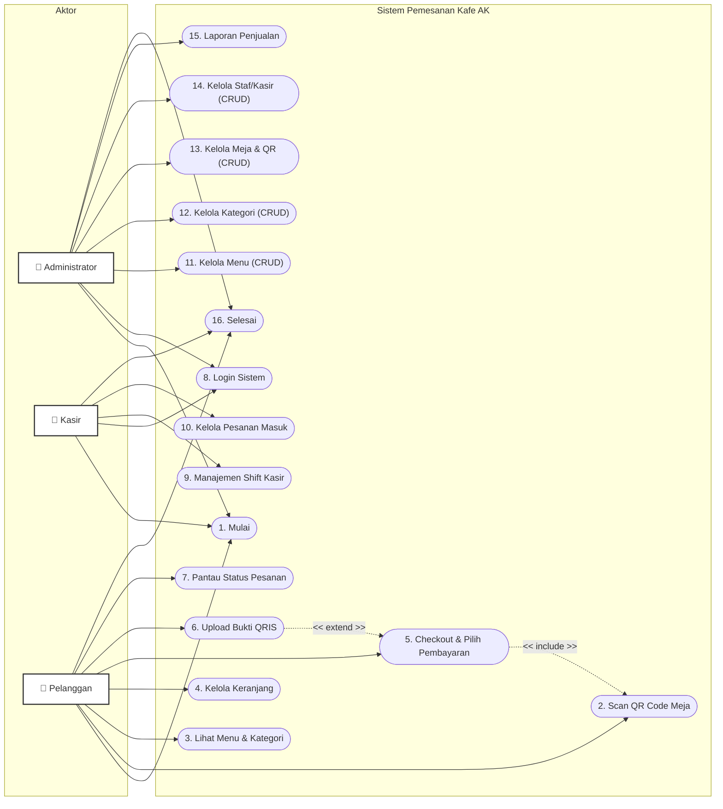

# Dokumen Perancangan: Use Case Diagram
## Sistem Pemesanan Kafe Berbasis QR Code (Pemesanan AK)

Dokumen ini memetakan interaksi aktor terhadap sistem dalam bentuk **Use Case Diagram** beserta penjelasannya untuk keperluan dokumentasi proyek, Skripsi, atau Tugas Akhir.

---

### 📊 Use Case Diagram (Mermaid)

Berikut adalah visualisasi use case diagram menggunakan format Mermaid Flowchart. Bentuk kapsul/oval `([ ... ])` digunakan untuk merepresentasikan Use Case, dan garis menghubungkan Aktor dengan fungsi sistem yang dapat mereka jalankan.

---

### 📝 Deskripsi Aktor & Hubungan Use Case

Di bawah ini adalah penjelasan lengkap mengenai peran masing-masing aktor beserta Use Case yang dapat mereka akses:

#### 1. Pelanggan (Customer)
Akses sistem bersifat *self-service* tanpa login, dimulai dari memindai kode QR fisik di meja.
*   **Mulai**: Memulai aktivitas pemesanan di kafe.
*   **Scan QR Code Meja**: Memindai QR Code yang berada di meja untuk mendapatkan akses menu dinamis sesuai nomor meja.
*   **Lihat Menu & Kategori**: Menjelajahi daftar makanan dan minuman yang dikelompokkan per kategori.
*   **Kelola Keranjang**: Menambah item, mengurangi item, serta menambahkan catatan khusus (misal: *"Es sedikit"*).
*   **Checkout & Pilih Pembayaran**: Menyelesaikan pesanan dan memilih metode pembayaran (Tunai/Cash atau QRIS).
*   **Upload Bukti QRIS**: Mengunggah foto bukti pembayaran jika memilih pembayaran QRIS mandiri.
*   **Pantau Status Pesanan**: Melihat pembaruan status pemrosesan pesanan secara real-time.
*   **Selesai**: Sesi pemesanan berakhir setelah pembayaran dikonfirmasi dan pesanan diterima.

#### 2. Kasir (Cashier)
Staf operasional yang bertanggung jawab atas proses transaksi harian di kafe.
*   **Mulai**: Datang ke toko dan memulai sesi kerja.
*   **Login Sistem**: Masuk ke aplikasi kasir menggunakan username dan password terdaftar.
*   **Manajemen Shift Kasir**: Membuka shift di awal kerja dan menutup shift di akhir kerja untuk rekapitulasi penjualan.
*   **Kelola Pesanan Masuk**: Menerima/menolak pesanan baru, memproses pesanan ke dapur, serta mengonfirmasi pelunasan pembayaran cash/bukti QRIS.
*   **Selesai**: Mengakhiri shift, melakukan logout, dan menyelesaikan sesi kerja.

#### 3. Administrator (Admin)
Pengelola dengan hak akses tertinggi yang bertanggung jawab atas manajemen data master dan analisis.
*   **Mulai**: Memulai pengelolaan sistem.
*   **Login Sistem**: Autentikasi keamanan untuk masuk ke dashboard admin.
*   **Kelola Menu (CRUD)**: Menambah, mengubah, menghapus menu makanan/minuman, mengunggah gambar menu, serta mengubah status ketersediaan.
*   **Kelola Kategori (CRUD)**: Mengatur kategori menu (seperti Coffee, Non-Coffee, Snacks).
*   **Kelola Meja & QR (CRUD)**: Mendaftarkan meja baru serta men-generate / mengunduh QR Code meja untuk dipasang secara fisik.
*   **Kelola Staf/Kasir (CRUD)**: Mengelola akun login staf kasir.
*   **Laporan Penjualan**: Melihat, memfilter berdasarkan tanggal, dan mencetak/rekapitulasi data riwayat penjualan per shift.
*   **Selesai**: Keluar dari dashboard sistem dan menyelesaikan sesi manajemen.
