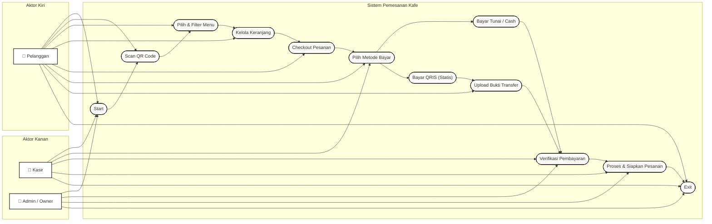

# Dokumen Perancangan: Use Case Diagram
## Sistem Pemesanan Kafe Berbasis QR Code (Pemesanan AK)

Dokumen ini memetakan interaksi aktor terhadap sistem dalam bentuk **Use Case Diagram** dengan alur terurut dari atas ke bawah (*Start* hingga *Exit*) seperti contoh yang diberikan.

---

### 📊 Use Case Diagram dengan Alur Aliran (Flowchart Layout)

Berikut adalah visualisasi Use Case Diagram. Semua fungsi utama diurutkan secara vertikal dari proses awal hingga akhir transaksi, dengan Pelanggan di sisi kiri, serta Kasir & Admin di sisi kanan.

---

### 📝 Penjelasan Detail Alur Use Case

Sesuai dengan bagan alur di atas, sistem bekerja secara berurutan sebagai berikut:

1.  **Start**
    *   **Aktor**: Pelanggan, Kasir, Admin.
    *   **Deskripsi**: Titik awal masuknya seluruh pengguna ke dalam sistem operasional kafe.
2.  **Scan QR Code**
    *   **Aktor**: Pelanggan.
    *   **Deskripsi**: Pelanggan memindai QR Code di meja untuk mendapatkan parameter meja di URL.
3.  **Pilih & Filter Menu**
    *   **Aktor**: Pelanggan.
    *   **Deskripsi**: Pelanggan menjelajahi katalog menu berdasarkan kategori.
4.  **Kelola Keranjang**
    *   **Aktor**: Pelanggan.
    *   **Deskripsi**: Pelanggan menambah atau mengurangi kuantitas item dan menyisipkan catatan khusus.
5.  **Checkout Pesanan**
    *   **Aktor**: Pelanggan.
    *   **Deskripsi**: Pelanggan mengunci pesanan dan mengirimkannya ke database backend.
6.  **Pilih Metode Bayar**
    *   **Aktor**: Pelanggan, Kasir.
    *   **Deskripsi**: Menentukan apakah pembayaran akan diselesaikan langsung dengan uang tunai ke kasir atau dengan metode scan QRIS.
7.  **Bayar Tunai / Cash & Bayar QRIS (Statis)**
    *   Jika **QRIS**: Pelanggan melompat ke Use Case **Upload Bukti Transfer** (Bukti pembayaran).
    *   Jika **Tunai**: Pelanggan langsung ke meja kasir untuk penyelesaian.
8.  **Verifikasi Pembayaran**
    *   **Aktor**: Kasir, Admin.
    *   **Deskripsi**: Kasir atau Admin memeriksa uang fisik yang diterima atau gambar bukti transfer QRIS yang diunggah oleh pelanggan untuk menandai status pesanan menjadi `Paid`.
9.  **Proses & Siapkan Pesanan**
    *   **Aktor**: Kasir, Admin.
    *   **Deskripsi**: Status pesanan diubah ke `Diproses` (dapur menyiapkan pesanan) lalu menjadi `Selesai` saat disajikan.
10. **Exit**
    *   **Aktor**: Pelanggan, Kasir, Admin.
    *   **Deskripsi**: Pelanggan meninggalkan kafe dan kasir/admin menutup shift penjualan mereka.
